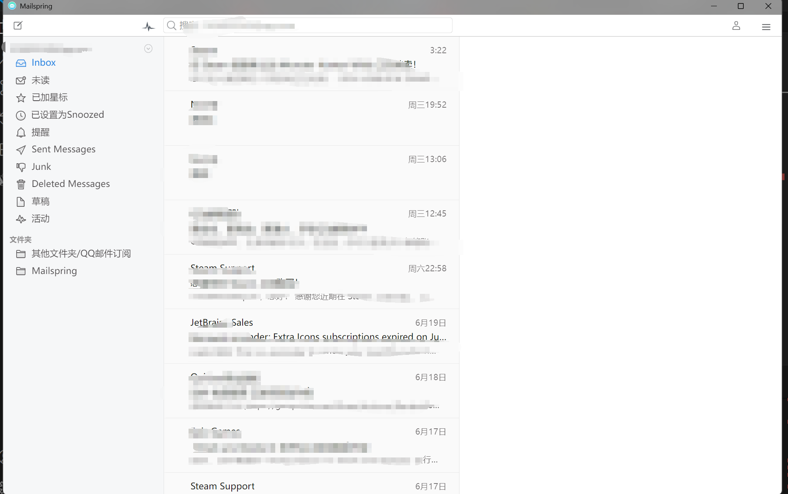
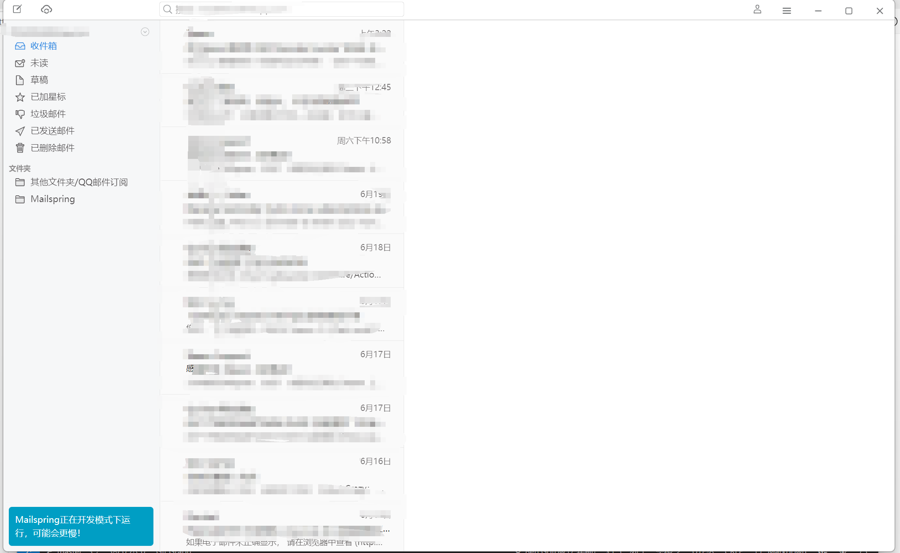

# 💌 Mailspring - 修改版

## 简介
Mailspring - 修改版，仅个人自用

[项目源地址](https://github.com/Foundry376/Mailspring)

## 新功能
1. 添加了邮件同步的快捷操作按钮
2. 默认开启深色主题自动切换（非官方最新版主题）
3. 添加了邮箱头像功能，可在`<root>\resources\app.asar.unpacked\static\avatars` 里修改或自定义
4. 修复了些许显示问题

## 更新日志

[点我查看](https://github.com/NiButCrazy/mailspring/blob/master/CHANGELOG.md)

## 对比

### 原版

### 修改版

